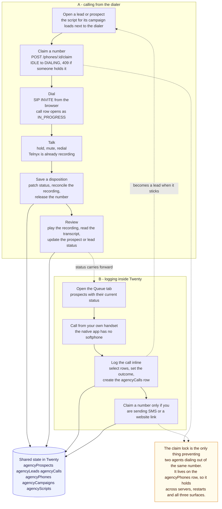
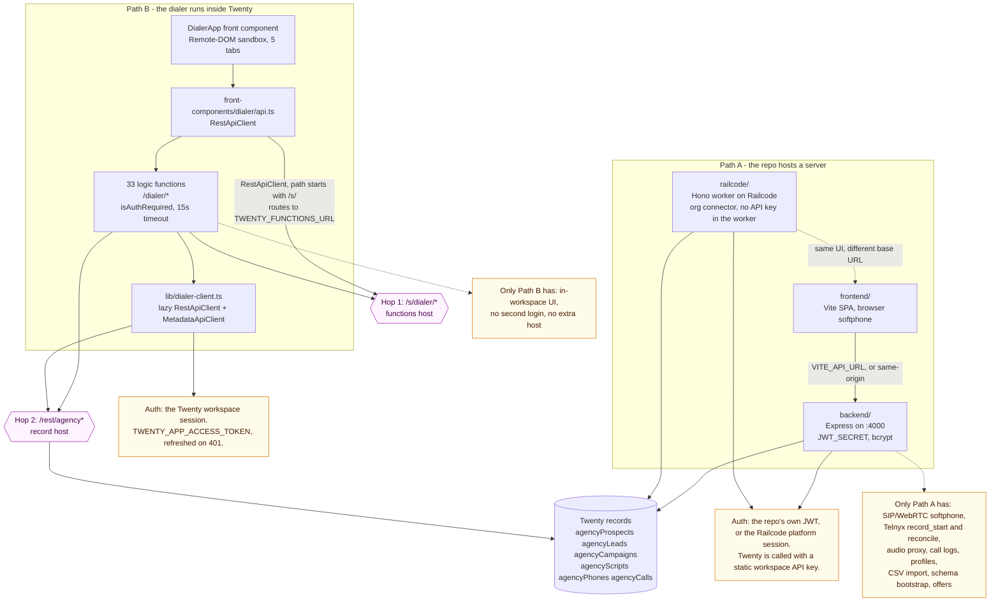
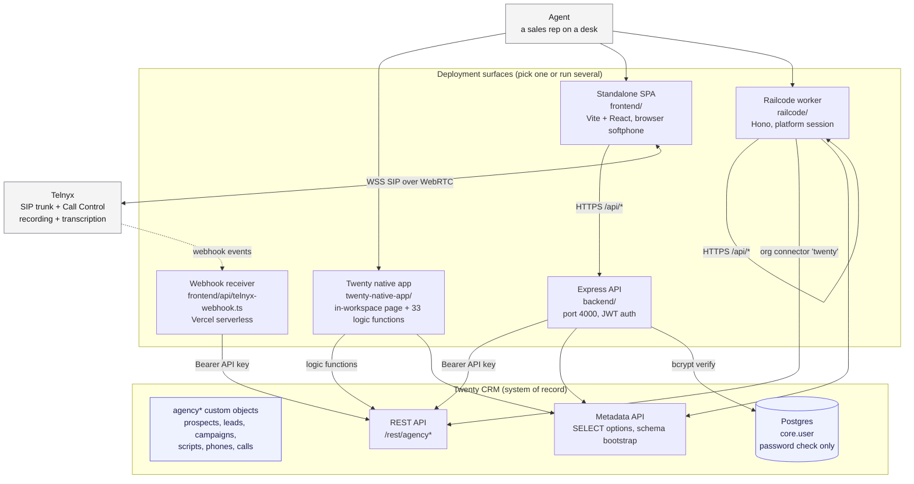
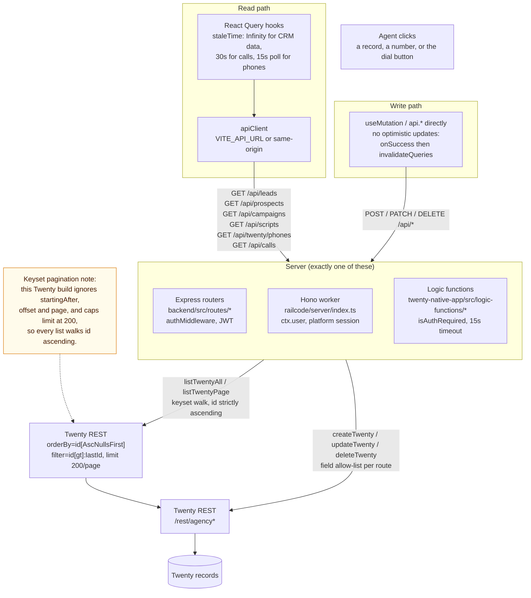
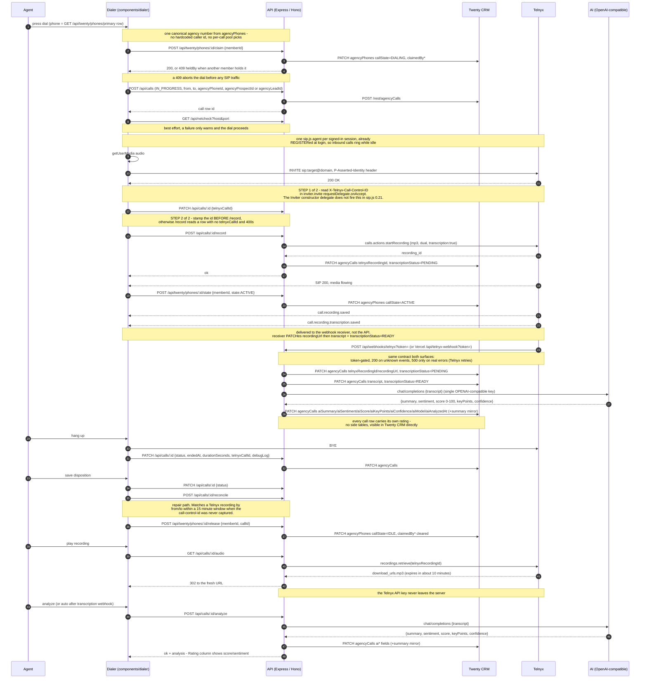
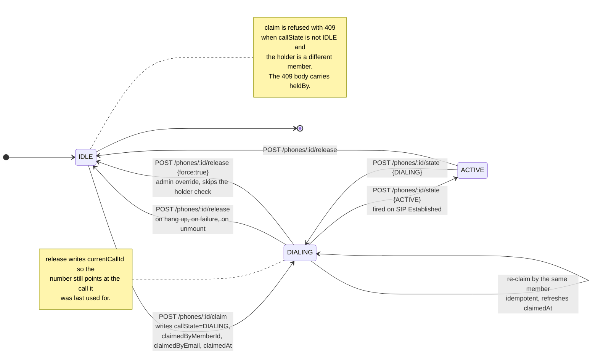
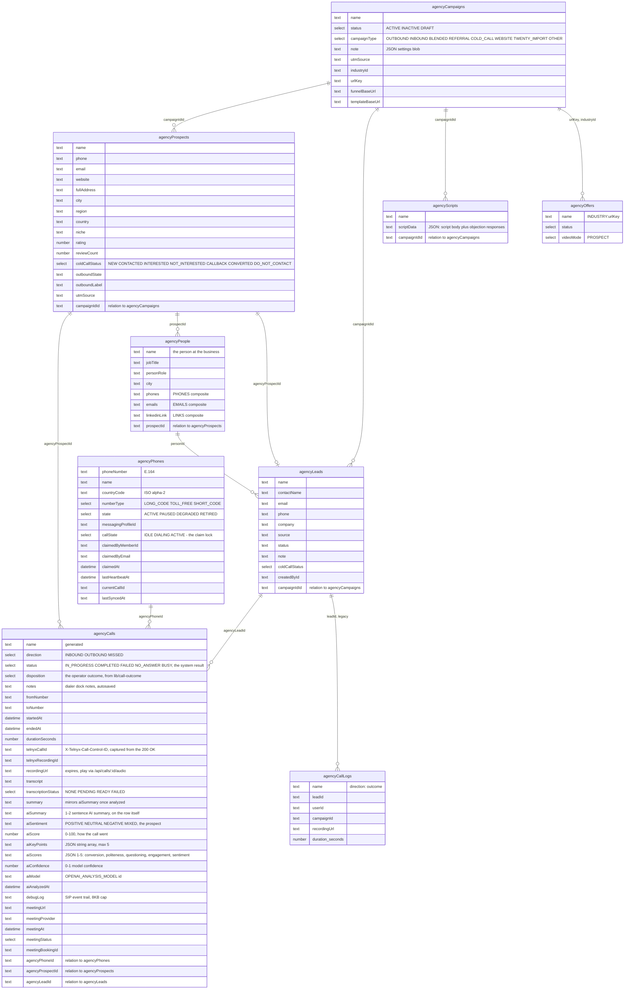
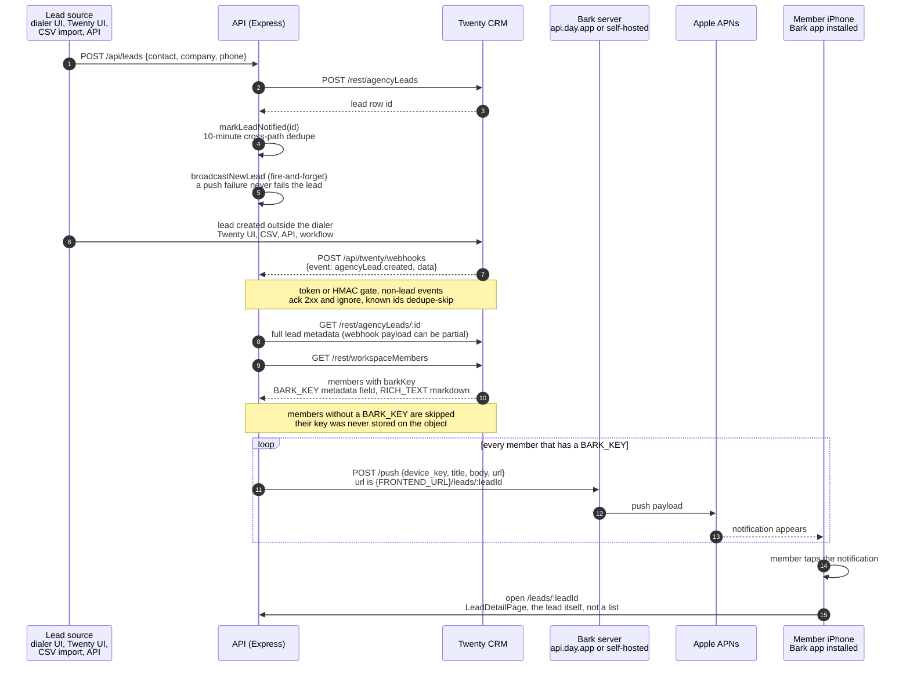
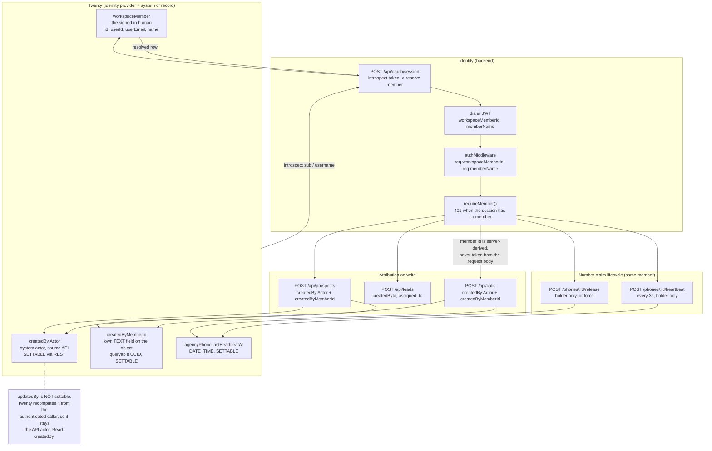

<p align="center">
  
</p>

# dialer

**A power dialing softphone CRM that works the same way as the GoHighLevel
dialer and the WAVV dialer: open source, in your browser, with every record
kept in [Twenty CRM](https://twenty.com).**

Built by [Matthew](https://github.com/matthewdonsemail-lab)
([@matthewsoldit on X](https://x.com/matthewsoldit)). Need telephony working
with your CRM? [Talk to Matthew on X](https://x.com/matthewsoldit).

[](https://opensource.org/licenses/MIT)
[](https://nodejs.org/)
[](https://twenty.com)
[](https://telnyx.com)

<p align="center">
  
</p>

Load a list, press call, and the dialer works through it: the script appears
next to the call, the call is recorded and transcribed, an AI rates it, and
one click on a disposition moves the contact on and dials the next. It is the
power dialing workflow agencies pay a monthly fee per seat for, rebuilt in the
open on top of Twenty, so you own the data and the code.

## Why it works

- **It works the moment you connect it.** There is no database to provision.
  Every prospect, lead, call, script, number and dial list is a custom object
  in your Twenty workspace, created by one command. The servers here only
  translate between the browser and the Twenty API, so there is nothing to
  migrate, back up or keep in sync.
- **The phone is in the browser.** SIP over WebRTC straight to Telnyx, with
  one registered agent per session, so inbound calls ring while you work.
  Hold, mute, keypad, notes and the script all live in a floating dialer that
  follows you around the app.
- **Power dialing, like WAVV.** Select contacts, start a dial list, and work it
  in order: the queue shows now and next, every call is logged, and a
  disposition advances the list.
- **Every call is reviewed.** Telnyx records server-side, the transcript lands
  on the call row by webhook, and an AI writes a summary, key points, a 0-100
  score and five quality ratings, visible in the dialer and in Twenty itself.
- **Two agents can never dial from the same number.** The number lock lives on
  the Twenty record, so it holds across servers, restarts and every surface.
- **State cannot go wrong.** Contact status, outreach, video, call result, dial
  lists and offers are state machines shared by the screens and the server, so
  a refused move (calling a do-not-contact, texting a number that cannot
  receive from yours) is refused in both places, with a reason.
- **Everything is guarded.** AST checks run on every commit; the full type
  check, tests and build run on every push. A button that does nothing, a
  toggle that hides its state or a hard-coded status cannot be committed.

## Screenshots

Every page and tab, in light mode, from the demo workspace (no real data).
The full set is in [docs/screenshots](docs/screenshots/README.md).

| | |
|---|---|
|  |  |
| **Reports**: calls, conversations, talk time, goal per member | **Contacts**: prospects and leads, paged and filtered on the server |
|  |  |
| **The dialer**: a live call with the campaign script beside it | **After the call**: one click on a disposition, then the next |
|  |  |
| **Call review**: AI summary, key points and quality ratings | **Admin**: every create, update and delete, by member |

## Run your own in five commands

You need [Bun](https://bun.sh), Node 20+, a [Twenty](https://twenty.com)
workspace (cloud or self-hosted) with an API key, and a
[Telnyx](https://telnyx.com) SIP connection for calls.

```bash
git clone https://github.com/matthewdonsemail-lab/dialer.git && cd dialer
bun run install:all
cp .env.example .env.local        # TWENTY_BASE_URL, TWENTY_API_KEY, JWT_SECRET, Telnyx
bun run twenty:schema             # creates every object, field and relation in Twenty
bun run twenty:seed               # optional: the demo workspace from the screenshots
bun run dev                       # backend :4000, frontend :5173
```

- `twenty:schema` is additive and safe to re-run: it creates what is missing
  and never edits or deletes. `bun run twenty:schema:check` is the dry run.
- `twenty:seed` loads 24 fictional businesses, 48 calls (one with a full
  transcript and AI review), scripts, numbers and dial lists. It refuses to
  write to a workspace that already has real prospects, and
  `bun run twenty:seed -- --reset` removes it again.
- Sign in with your Twenty account (OAuth). The full reference is in
  [SETUP.md](SETUP.md).

## How it was built

Matthew built this to run his own agency's outbound calling on Twenty instead
of renting a dialer seat per rep. The dialers it is modelled on keep your
calls in their own system; this one writes every call, recording link,
transcript and rating onto the Twenty record, where the rest of the CRM can
use it.

The latest round of work, all in this repository's history:

- **A contact workspace in the style of the GoHighLevel contact page.** Details
  and the people at the business on the left, one timeline of calls, notes and
  changes in the middle, and panels for the call summary, record history,
  script, notes, and the website and video sent to the prospect.
- **A global dialer dock.** One floating dialer with recents, contacts, keypad,
  queue, a live-call view with notes and the script, and an after-call summary.
- **Readable record history**, modelled on HubSpot, Close, Attio and Zoho:
  "Status changed from Contacted to Interested", never raw JSON.
- **One prospect page per business** on a canonical offer URL, with a live
  preview, and a same-country rule so a number never texts a country it
  cannot reach.
- **Shared state machines** for every pipeline field, used by both the API
  and the screens.
- **A design system** with one type scale, one radius scale, Font Awesome 6
  icons and page-shaped loading skeletons, enforced by a pre-commit check.
- **A failure map**: every create, update and delete reports its failure in
  words (see [docs/feedback-map.md](docs/feedback-map.md)), with no silent errors.
- **A whole-repo move** to a camelCase `domains/<domain>/<primitive>` layout,
  done by an AST codemod and enforced on every commit.
- **Open-source setup**: the one-command Twenty schema, the demo seed, and the
  screenshot capture that produced every image in this README.

---

## Contents

- [Why it works](#why-it-works)
- [Screenshots](#screenshots)
- [Run your own in five commands](#run-your-own-in-five-commands)
- [How it was built](#how-it-was-built)
- [The workflow](#the-workflow)
- [What it does](#what-it-does)
- [The three surfaces](#the-three-surfaces)
- [Architecture](#architecture)
- [Data flow](#data-flow)
- [The call](#the-call)
- [Data model](#data-model)
- [Running it](#running-it)
- [Configuration](#configuration)
- [Production authentication](#production-authentication)
- [Repository layout](#repository-layout)
- [API reference](#api-reference)
- [Documentation map](#documentation-map)
- [Checks](#checks)
- [License](#license)

---

## The workflow

Two ways to work, depending on whether you need the browser softphone.

### A. Calling from the dialer

Needs a softphone, so this is the standalone path (`frontend/` or `railcode/`).
The browser holds the SIP call itself.

1. **Open a lead or prospect.** The script for its campaign loads next to the
   dialer, with its objection handling.
2. **Claim a number.** `POST /phones/:id/claim` moves it `IDLE` to `DIALING`. If
   another member holds it you get a 409 naming them, and the dial aborts
   before any SIP traffic.
3. **Dial.** The call row opens as `IN_PROGRESS` *before* the INVITE, so a call
   that fails to connect is still on record.
4. **Talk.** Hold, mute and redial from the softphone. Telnyx is already
   recording server-side from the moment it connects.
5. **Save a disposition.** One action patches the call status, runs the
   recording reconcile, releases the number, and moves the prospect or lead
   status.
6. **Review.** The recording and transcript are on the call row, attached by
   webhook a few seconds after you hang up. Play them from call history.

### B. Logging inside Twenty

The native app has no softphone, so you call from your own handset and write the
result back. No second login, no extra host.

1. **Open the Queue tab** - prospects with their current status.
2. **Call from your own handset.**
3. **Log the call inline** - select rows, set the outcome, and it creates the
   `agencyCalls` row for you.
4. **Claim a number** only if you are also sending an SMS or a website link.

Both paths read and write the same six objects, so status carries forward in
either direction. A prospect that showed interest becomes a lead, and the
script and the offer follow it.

<!-- mermaid:agent-workflow.mmd -->


> Source: [`docs/diagrams/agent-workflow.mmd`](docs/diagrams/agent-workflow.mmd).

| | |
|---|---|
|  |  |
| A contact with its call summary | A live call with notes |

The claim lock is the only thing stopping two agents dialing out of the same
number. It lives on the `agencyPhones` row rather than in server memory, so it
holds across servers, restarts, and all three surfaces. Read
[architecture.md](docs/architecture.md) before changing it: it is also the
thinnest security in the codebase.

## What it does

- **Browser softphone.** SIP over WebRTC, dial from any contact, hold, mute,
  keypad, notes, redial, and take inbound calls. Or bridge the call to your own
  phone (Settings, Audio Source) when the browser has no headset.
- **Power dialing.** Select contacts and start a dial list (a `callCampaign` in
  Twenty). The dock's queue shows now and next; a disposition moves on.
- **A floating dialer dock.** Recents, contacts, keypad and queue when idle; a
  live view with notes and the campaign script during a call; an after-call
  summary with every disposition one click away. Pin it open or let it close.
- **Number locking.** One member holds a number for the duration of a call, so
  two agents cannot dial from the same line. Enforced in Twenty, so it holds
  across servers and restarts.
- **Recording, transcript and AI review.** Started server-side through Telnyx
  Call Control, attached to the call row by webhook, then rated by any
  OpenAI-compatible model: summary, key points, 0-100 score, sentiment and five
  1-5 quality ratings.
- **A contact workspace.** Details and the people at the business, one timeline
  of calls, notes and readable record history, and panels for the call summary,
  the script, notes, and the website and video sent to the prospect.
- **Website and SMS outreach.** One prospect page per business, previewed in the
  app, sent by SMS from a number in the same country as the contact.
- **Reports and admin.** Calls, conversations, talk time and goal per member;
  number health; dispositions; and an activity log of every change, by member.
- **Runs inside Twenty.** A native app gives an agent the queue, the numbers and
  the call log without a second login.

## The three surfaces

Same product, same six objects, three independent code paths. None calls
another.

| | Directory | Server | Use it for |
|---|---|---|---|
| Standalone | `frontend/` + `backend/` | Express on `:4000` | the softphone, Telnyx, recording |
| Workspace | `railcode/` | Hono on Railcode | a private, org-only deployment |
| Native | `twenty-native-app/` | none, runs inside Twenty | dialing without a second host |

The native app is the newest and the direction of travel. The standalone path
is the only one with a real softphone: the native app does not implement
SIP/WebRTC, recording, or audio playback.

`railcode/` is a hand-maintained port of `frontend/`. The softphone is
byte-identical between them; when you fix a bug in one, expect to apply it in
the other.

<!-- mermaid:integration-paths.mmd -->


> Source: [`docs/diagrams/integration-paths.mmd`](docs/diagrams/integration-paths.mmd).
> It records what only each path can do, which is the question this repository
> gets asked most.

| | |
|---|---|
|  |  |
| Sign in with Twenty | Settings: audio source |

## Architecture

<!-- mermaid:system-context.mmd -->


> Source: [`docs/diagrams/system-context.mmd`](docs/diagrams/system-context.mmd).

| | |
|---|---|
|  |  |
| Reports: team performance | Admin: overview |

Read [docs/architecture.md](docs/architecture.md) for the route tables, the
auth model, and the places where the security is thinner than it looks.

## Data flow

<!-- mermaid:data-flow.mmd -->


> Source: [`docs/diagrams/data-flow.mmd`](docs/diagrams/data-flow.mmd).

| | |
|---|---|
|  |  |
| Contacts, paged on the server | Call history |

The one thing to know: this Twenty build ignores `startingAfter`, `offset` and
`page`, and caps `limit` at 200. Cursor pagination does not work, so every list
is a keyset walk over `id`, ascending, 200 per page, bounded.

```
GET /rest/agencyProspects
      ?limit=200
      &orderBy=id[AscNullsFirst]
      &filter=id[gt]:"<last id seen>"
```

More on this, and on the read and write paths, in
[docs/data-flow.md](docs/data-flow.md).

## The call

<!-- mermaid:call-lifecycle.mmd -->


> Source: [`docs/diagrams/call-lifecycle.mmd`](docs/diagrams/call-lifecycle.mmd).

| | |
|---|---|
|  |  |
| Recording and transcript | AI review |
|  |  |
| Technical: the SIP trail | A live call with the script |

Two steps in that sequence are load-bearing, and both have broken the recording
before:

1. The Telnyx call-control id has to be read in the `requestDelegate` passed to
   `inviter.invite()`. The `Inviter` constructor delegate does not fire
   `onAccept` in sip.js 0.21.
2. That id has to be stamped onto the row with a `PATCH` **before**
   `POST /api/calls/:id/record`, because `/record` re-reads the row and returns
   400 when `telnyxCallId` is empty.

`POST /api/calls/:id/reconcile` is the repair path when the id was never
captured: it matches a Telnyx recording by from and to within a 15 minute
window.

Telnyx download URLs expire in about ten minutes, so `GET /api/calls/:id/audio`
re-resolves a fresh URL and 302s to it. The API key never leaves the server.

### The number lock

<!-- mermaid:phone-claim.mmd -->


> Source: [`docs/diagrams/phone-claim.mmd`](docs/diagrams/phone-claim.mmd).

| | |
|---|---|
|  |  |
| Phone numbers with their claim state | Reports: number health |

The claim state lives on the `agencyPhones` row in Twenty rather than in server
memory, so it survives a restart and every surface sees the same answer. The
full state machine, including the 409 and `force` paths, is in the diagram.

## Data model

<!-- mermaid:data-model.mmd -->


> Source: [`docs/diagrams/data-model.mmd`](docs/diagrams/data-model.mmd).

| | |
|---|---|
|  |  |
| Admin: the Twenty objects | Record history on a contact |

`bun run twenty:schema` (or `POST /api/setup/twenty`) creates all of these,
plus `agencyPerson`, `callCampaign` (dial lists) and `dialerAudioSession`, from
one manifest: [backend/src/lib/twenty/schema/manifest.ts](backend/src/lib/twenty/schema/manifest.ts).
That is 10 objects, 134 fields and 9 relations, with select options exactly as
the live workspace has them. It only adds what is missing and never edits or
deletes, so it is safe to run against a workspace in use; `twenty:schema:check`
reports what it would create. `GET /api/setup/twenty/status` checks the same
manifest from the running app.

One API rule worth memorising: Twenty writes relation fields as
`{fieldName}Id`, so a relation declared as `campaignId` is sent as
`campaignIdId`.

### New-lead phone notifications

<!-- mermaid:bark-new-lead-notify.mmd -->


> Source: [`docs/diagrams/bark-new-lead-notify.mmd`](docs/diagrams/bark-new-lead-notify.mmd).

| | |
|---|---|
|  |  |
| A lead | Notes on a contact |

### Member identity and record attribution

Records the dialer writes are attributed to the member who is signed in, not to
the API key. Two channels are written side by side, and both depend on schema
that `POST /api/setup/twenty` creates.

<!-- mermaid:member-attribution.mmd -->


> Source: [`docs/diagrams/member-attribution.mmd`](docs/diagrams/member-attribution.mmd).

| | |
|---|---|
|  |  |
| Admin: activity by member | Admin: team activity |

The member id is derived server-side from the JWT, never read from a request
body, so a caller cannot claim to be someone else. Two consequences worth
knowing:

- `createdBy` is settable and reads back the real member.
- `updatedBy` is **not** settable. Twenty recomputes it from the authenticated
  caller, so it keeps reporting the API actor. Attribution reads `createdBy`.

Because both channels write plain fields, the object must actually have them.
`GET /api/setup/twenty/status` lists every field the routes read or write and
reports `exists: false` for anything the workspace is still missing.

### Key status values

`agencyProspects.coldCallStatus`

| Value | Meaning |
|---|---|
| `NEW` | no contact made |
| `CONTACTED` | initial contact made |
| `INTERESTED` | showed interest |
| `NOT_INTERESTED` | declined |
| `CALLBACK` | needs a callback |
| `CONVERTED` | became a lead |
| `DO_NOT_CONTACT` | do not call again |

`agencyCalls.status`

| Value | Meaning |
|---|---|
| `IN_PROGRESS` | dialled, not yet wrapped up |
| `COMPLETED` | answered, or a wrap-up status the UI does not distinguish |
| `NO_ANSWER` | rang out |
| `BUSY` | busy |
| `FAILED` | transport or setup failure |

`agencyPhones.callState`

| Value | Meaning |
|---|---|
| `IDLE` | free |
| `DIALING` | claimed, call not yet up |
| `ACTIVE` | answered |

Full field tables are in [docs/okf/datamodel/dialer.md](docs/okf/datamodel/dialer.md).

## Running it

The short version is [Run your own in five commands](#run-your-own-in-five-commands).
In more detail:

```bash
git clone https://github.com/matthewdonsemail-lab/dialer.git
cd dialer
bun run install:all             # root, shared package, backend, frontend

cp .env.example .env.local      # Twenty, JWT, Telnyx, OpenAI-compatible key
cp frontend/.env.example frontend/.env.local   # VITE_API_URL and VITE_SIP_*

bun run twenty:schema:check     # what your workspace is missing
bun run twenty:schema           # create it
bun run twenty:seed             # optional demo data (fresh workspaces only)

bun run dev                     # backend on :4000, frontend on :5173
```

Open http://localhost:5173 and sign in with your Twenty account. Twenty is the
identity provider (OAuth with PKCE, see [docs/identity.md](docs/identity.md));
the dialer keeps no users of its own. Port 5173 is pinned because it is the
OAuth client's registered redirect.

The screenshots in this README come from the same demo data, captured by a
script that never touches a real workspace:

```bash
bunx playwright install chromium   # once
bun run screenshots                # every page and tab into docs/screenshots/
```

The native app is a separate build with its own toolchain:

```bash
cd twenty-native-app
yarn install
yarn twenty app:publish --private
yarn twenty app:install
```

`twenty-native-app/AGENTS.md` is the Twenty team's own guide for this project
structure, and it is worth reading before changing anything under
`twenty-native-app/src/`.

More in [docs/quick-start.md](docs/quick-start.md) and [SETUP.md](SETUP.md).

## Configuration

Full reference in [SETUP.md](SETUP.md). The shape of it:

```env
# Twenty CRM. Required by every server.
TWENTY_BASE_URL=https://twenty.example.com
TWENTY_API_KEY=

# backend/ only. Signs its own JWTs.
JWT_SECRET=
PORT=4000

# Telnyx. Server-side only, never VITE_.
TELNYX_API_KEY=
TELNYX_WEBHOOK_TOKEN=        # shared gate for the webhook receiver (?token=)
```

```env
# frontend/. Baked into the bundle at build time.
VITE_API_URL=http://localhost:4000
VITE_SIP_URI=sip:username@sip.telnyx.com
VITE_SIP_PASSWORD=
VITE_SIP_WS_URL=wss://sip.telnyx.com:7443
VITE_SIP_CALLER_ID=+15551234567
VITE_SIP_PROVIDER=telnyx
```

`VITE_SIP_*` values are compiled in, so changing one needs a rebuild. That is
also why a redeploy can serve a bundle with stale SIP config if the CDN is
cached; the app detects a stale chunk and reloads with a cache buster.

SIP is not Telnyx-specific. See [docs/sip-providers.md](docs/sip-providers.md).

## Production authentication

Production sign-in is a Twenty OAuth PKCE flow: the browser receives a code,
the backend redeems it, introspects the Twenty token, resolves a real workspace
member, and mints a 24-hour dialer JWT. The October 2026 Vercel incident came
from a failed backend entrypoint, missing SPA deep-link routing, and incomplete
Production environment variables. That produced distinct errors in sequence:
missing OAuth config, a CORS 403, and a session-mint 502. The commit history,
fixes, required settings, and status-code guide are in the
[production OAuth incident and runbook](docs/production-oauth-runbook.md).

## Repository layout

Every folder and file is camelCase, and everything lives in a domain, then a
primitive named after what it is about. [docs/naming-conventions.md](docs/naming-conventions.md)
has the rule; `scripts/check-code.mjs` enforces it on every commit.

```
dialer/
├── backend/                     Express API, port 4000
│   └── src/
│       ├── lib/<domain>/        twenty (client, schema, pipelines...), telnyx, ai, website, demo
│       ├── middleware/          auth (JWT)
│       └── routes/<domain>/     one module per resource: prospects, calls, people, callCampaigns...
├── frontend/                    Vite SPA, the browser softphone
│   ├── api/telnyx-webhook.ts    Telnyx webhook receiver (Vercel function)
│   └── src/domains/<domain>/<primitive>/
│                                app, auth, api, ui, dialer, calls, contact, campaigns,
│                                scripts, reports, admin, feedback, website, settings...
├── packages/shared/             @dialer/shared: the state machines, SMS route rule,
│                                and the generated Twenty client, used by both sides
├── railcode/                    same UI, Hono worker, Railcode deployment
├── twenty-native-app/           the dialer as a Twenty app
├── docker/                      Dockerfiles, compose, nginx configs
├── docs/                        everything below, plus screenshots/ and diagrams/
└── scripts/                     the commit and push checks, codemods, screenshot capture
```

Deliberately **not** tracked: host-specific infrastructure, unrelated apps,
vendored third-party skills, deploy staging output, and credentials. See
[.gitignore](.gitignore) and
[scripts/twenty-schema/README.md](scripts/twenty-schema/README.md).
`scripts/check-scope.mjs` fails the push if any of them comes back.

## API reference

Mounted by `backend/src/index.ts`, mirrored in `railcode/server/index.ts`, and
served inside Twenty at `/dialer/*`.

| Method | Path | Notes |
|---|---|---|
| GET | `/api/oauth/config` | Public OAuth client and callback configuration for the SPA. |
| POST | `/api/oauth/token` | Redeems a Twenty authorization code using the PKCE verifier. |
| POST | `/api/oauth/session` | Introspects the Twenty token, resolves a workspace member, and mints the dialer JWT. |
| GET | `/api/auth/me` | Current workspace member from the dialer JWT. |
| POST | `/api/auth/signup` | Disabled; create the member in Twenty, then use Twenty SSO. |
| GET POST PATCH DELETE | `/api/leads` | CRUD. |
| GET POST PATCH DELETE | `/api/prospects` | CRUD. |
| GET | `/api/prospects/:id/website-status` | Resolves the industry funnel and offer URLs. |
| POST | `/api/prospects/:id/website-sent` | Advances `outboundLabel` to `SMS_IN_PROGRESS`. |
| POST | `/api/prospects/:id/ensure-offer` | Idempotently creates the `INDUSTRY:<key>` offer. |
| GET POST PATCH DELETE | `/api/campaigns` | CRUD. |
| GET POST PATCH DELETE | `/api/people` | The people at a business (`agencyPerson`), by `prospectId` or `leadId`. |
| GET POST PATCH DELETE | `/api/call-campaigns` | Dial lists for power dialing. Status follows the shared `callCampaign` machine. |
| GET | `/api/prospects/page` | Contacts a window at a time, searched, filtered and sorted in Twenty. |
| GET | `/api/prospects/facets` | Counts per status, country, industry and campaign for the filter menus. |
| GET | `/api/admin/activity` | Create, update and delete events on dialer records, or one record's history. |
| POST | `/api/calls/:id/analyze` | AI review of the transcript, written onto the call row. |
| GET POST | `/api/audio-sessions` | Phone audio: the call bridged to the agent's own phone. |
| GET POST PATCH DELETE | `/api/scripts` | CRUD. `scriptData` is a JSON string. |
| GET | `/api/twenty/phones` | Inventory with live claim state. |
| POST | `/api/twenty/phones/:id/claim` | `IDLE` to `DIALING`. 409 with `heldBy` when taken. |
| POST | `/api/twenty/phones/:id/state` | `DIALING` or `ACTIVE`. Holder only. |
| POST | `/api/twenty/phones/:id/release` | Back to `IDLE`. Holder only unless `force`. |
| GET | `/api/twenty/meta/:object` | SELECT options, from the Twenty metadata API. |
| POST | `/api/setup/twenty` | Creates whatever the schema manifest has that the workspace lacks. |
| GET | `/api/setup/twenty/status` | Every manifest object and field, with `exists`. |
| GET | `/api/calls` | Newest first. |
| GET | `/api/calls/:id/audio` | 302 to a freshly resolved Telnyx mp3. |
| POST | `/api/calls/:id/record` | `record_start` with transcription. Needs `telnyxCallId`. |
| POST | `/api/calls/:id/reconcile` | Repair path: match a recording by from and to. |
| POST | `/api/calls` | Creates the row. Best effort, also stamps `currentCallId`. |
| PATCH | `/api/calls/:id` | Disposition, recording, transcript, meeting, `debugLog`. |
| GET | `/api/health` | Config flags. |
| GET | `/api/netcheck` | Allowlisted TCP probe. Best effort. |

`/api/call-logs` and `/api/profiles` are legacy, read the old call log object,
and are **not** behind `authMiddleware`. Everything else is.

## Documentation map

Full index with descriptions: [docs/README.md](docs/README.md).

**Understand it**

- [Architecture](docs/architecture.md) - the three surfaces, the servers, the auth model
- [Data flow](docs/data-flow.md) - reads, writes, keyset pagination, the schema
- [Diagrams](docs/diagrams/README.md) - all six, with the source that implements each

**Run it**

- [Quick start](docs/quick-start.md)
- [Setup reference](SETUP.md) - `setup.sh`, the schema command, the demo seed
- [Screenshots](docs/screenshots/README.md) - every page and tab
- [Design system](docs/design-system.md) - the scale, primitives and shared pipelines every screen uses
- [SIP providers](docs/sip-providers.md)

**Ship it**

- [Deployment](docs/deployment.md)
- [Contributing](CONTRIBUTING.md) - hooks, checks, commit convention
- [Changelog](CHANGELOG.md)

**When it breaks**

- [Production OAuth incident and runbook](docs/production-oauth-runbook.md) - Vercel deployment history, production config, and status-code triage
- [Twenty troubleshooting](docs/twenty-troubleshooting.md)
- [Telnyx reference](docs/telnyx/README.md)

**Reference, not documentation**

- [Plans](docs/plans/) - scoped but unbuilt design work
- [Marketing](docs/marketing/) - launch copy
- [Data model snapshot](docs/okf/datamodel/dialer.md)
- [Twenty schema helpers](scripts/twenty-schema/README.md) - local only, gitignored
- `docs/telnyx/upstream/`, `docs/twenty/upstream/` - mirrored vendor docs, gitignored.
  Fetch with `bun run docs:telnyx` and `bun run docs:twenty`.

## Checks

```bash
bunx lefthook install     # once, after cloning
```

Three gates, cheapest first. All of them are plain `node scripts/*.mjs` or the
repo's own build and test commands; [CONTRIBUTING.md](CONTRIBUTING.md) has the
full table and the bypass variable for each.

| Gate | Runs |
|---|---|
| pre-commit | the branch name, the staged code on the TypeScript AST (naming, layout, dead buttons, hidden toggle state, hard-coded pipeline values), the design system, no emojis, no monospace, no fully rounded corners, no credentials, and `bun.lock` with any dependency change |
| commit-msg | Conventional Commits, header at most 72 characters |
| pre-push | every file against the code rules, types in all three packages, every unit test, the production build, the CRUD failure map, the docs and diagrams, and the scope check |

Run any of them by hand:

```bash
node scripts/check-code.mjs
node scripts/run-tests.mjs
bun run check:docs
bunx lefthook run pre-push
```

## License

MIT. See [LICENSE](LICENSE).

---

<!-- footer:offer-set:start -->
## Support

If this is useful, a star helps someone else find it.

[](https://github.com/matthewdonsemail-lab/dialer/stargazers)
[](https://github.com/matthewdonsemail-lab/dialer/network/members)
[](https://github.com/matthewdonsemail-lab/dialer/watchers)
[](https://github.com/matthewdonsemail-lab/dialer/commits)
[](https://github.com/matthewdonsemail-lab/dialer/blob/main/LICENSE)

[](https://github.com/matthewdonsemail-lab/dialer)
[](https://x.com/matthewsoldit)
[](https://github.com/matthewdonsemail-lab/dialer/issues)
[](https://github.com/matthewdonsemail-lab/dialer/pulls)

## Star history

[](https://star-history.com/#matthewdonsemail-lab/dialer&Date)
<!-- footer:offer-set:end -->
