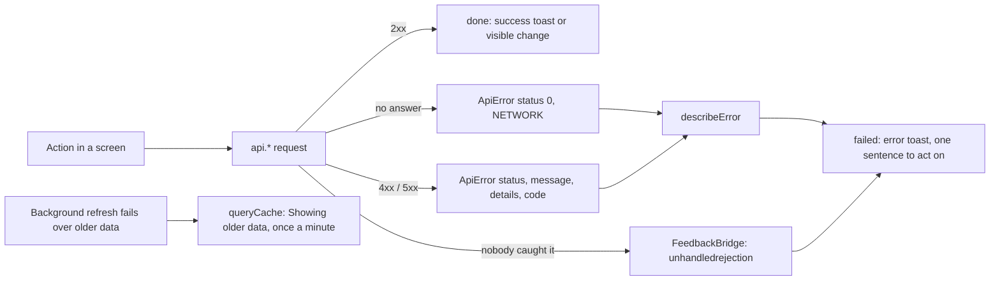

# Feedback map

Every create, read, update and delete in the dialer, and what the person sees when it works or fails. A CRUD app that fails quietly loses data without anyone noticing, so the rule is simple: **no action fails without telling someone**, and the message says what to do next.

The tables at the bottom are generated from the code (`node scripts/audit-feedback.mjs --write`) and checked on every push, so this map cannot drift from the app.

## How a failure travels

- **`ApiError`** (`domains/api/client/apiError.ts`) carries the HTTP status, the server's message, its `details` (usually Twenty's own reason) and a `code` (`INVALID_TRANSITION`, `SMS_ROUTE_BLOCKED`, `NETWORK`). Requests that get no answer at all become status 0, not a raw "Failed to fetch".
- **`describeError(err)`** (`domains/feedback`) is the one place an error becomes words:

| Status | Kind | What the person reads |
|---|---|---|
| 0 | network | The dialer server could not be reached. Check your connection, then try again. |
| 401 | auth | Your session has ended. Sign in again, then repeat the change. |
| 403 | forbidden | The server's reason, or "You are not allowed to do this." |
| 404 | missing | The server's reason, or "It no longer exists in Twenty. Refresh the page." |
| 409 | refused | The pipeline's reason, unchanged ("Converted cannot move to Call back. Allowed next: Do not contact.") |
| 400, 422 | invalid | The server's reason ("A US / Canada number cannot text Irish numbers…") |
| 5xx | server | "Twenty did not accept the change: <Twenty's details>", or "The server had a problem. Try again." |

Refusals (409, 422) are not retryable: the message says what has to change first. Never write "Try again" for them.

## Wording

`useFeedback()` gives every screen the same four calls:

| Call | Toast | Title pattern | Example |
|---|---|---|---|
| `done(title, detail?)` | success | `<Thing> <past verb>` | Person added · Script saved · Marked as sent |
| `failed(title, err)` | error | `<Thing> not <verb>` + `describeError` | Status not saved: Converted cannot move to Call back… |
| `blocked(title, detail?)` | warning | What stopped the action | No free sending number · Nothing left to dial |
| `info(title, detail?)` | info | Neutral news | |

- Nothing went wrong when the person simply could not start (nothing selected, nothing left, already on a call): that is a **warning**, not an error.
- Titles never say just "Error" (the audit fails the push).
- Inline problems that belong to one card (a blocked send, a failed preview) use a `Notice` in that card instead of a toast.
- Optimistic edits roll back on failure and the toast says so in its detail.

## Safety nets

| Net | Catches | Where |
|---|---|---|
| `FeedbackBridge` | An `ApiError` promise that nothing awaited or caught | `domains/feedback/bridge/feedbackBridge.tsx`, mounted in `App.tsx` |
| Query cache | A background refresh that fails while older data is on screen | `lib/query-client` |
| Pages | A first load that fails: the page's own error state, not a toast | each page |
| `ErrorBoundary` | A render crash | `domains/app/errorBoundary/errorBoundary.tsx` |

## Enforced on push

`node scripts/audit-feedback.mjs --check` (lefthook) fails when:

- an `api.*` write has no failure path (no try/catch, `.catch`, mutation `onError`, or caller that awaits it);
- `mutateAsync()` is called outside a try or `.catch`;
- `.mutate()` is called on a shared hook that has no `onError` without passing one;
- an `api.*` error is dropped with an empty catch;
- a toast is titled only "Error";
- the tables below are out of date.

## Background work

Some calls run with no one waiting on them: the number-claim heartbeat, setting a number Active, releasing it, reconciling a recording, stamping the call-control id. Their failures are not toasted (the person can do nothing about them) but are written to the SIP log (`sipLog`, shown in the call's debug log), and each has a fallback: a claim goes stale and frees itself, the recording webhook matches by number and time.

## The map

<!-- feedback-map:begin -->
Generated by `node scripts/audit-feedback.mjs --write`. Do not edit by hand.

### Toasts (61)

| Kind | Title | Where |
|---|---|---|
| error | Analysis not run | `domains/calls/review/callDetailPage.tsx:99` |
| error | Campaign not created | `domains/contact/list/contactListPage.tsx:253` |
| error | Campaign not deleted | `domains/campaigns/campaignModal/campaignModal.tsx:358` |
| error | Campaign not marked complete | `domains/campaigns/powerDialer/powerDialer.tsx:128` |
| error | Contact not deleted | `domains/contact/list/contactListPage.tsx:204` |
| error | Contact not hung up | `domains/dialer/provider/dialerProvider.tsx:545` |
| error | Contact status not updated | `domains/dialer/provider/dialerProvider.tsx:680` |
| error | Contacts not deleted | `domains/contact/list/contactListPage.tsx:236` |
| error | Contacts not refreshed | `domains/contact/list/contactListPage.tsx:225` |
| error | Copy failed | `domains/website/panel/websitePanel.tsx:108` |
| error | Disposition not saved | `domains/dialer/provider/dialerProvider.tsx:670` |
| error | Industry copy not created | `domains/website/panel/websitePanel.tsx:128` |
| error | Name not saved | `domains/campaigns/campaignModal/campaignModal.tsx:138` |
| error | No phone number for Call me | `domains/dialer/audio/audioBridge.tsx:89` |
| error | Not copied | `domains/ui/multiValue/multiValue.tsx:98` |
| error | Not deleted | `domains/contact/page/contactPage.tsx:95` |
| error | Not marked as sent | `domains/website/panel/websitePanel.tsx:119` |
| error | Not saved | `domains/contact/page/contactPage.tsx:75` |
| error | Person not removed | `domains/contact/people/contactPeople.tsx:50` |
| error | Person not saved | `domains/contact/people/contactPeople.tsx:40` |
| error | Phone audio did not connect | `domains/dialer/audio/audioBridge.tsx:66` |
| error | Phone audio did not start | `domains/dialer/audio/audioBridge.tsx:97` |
| error | Phone line status unknown | `domains/dialer/audio/audioBridge.tsx:71` |
| error | Recording not checked | `domains/calls/review/callDetailPage.tsx:108` |
| error | Script not created | `domains/scripts/workspace/scriptsWorkspace.tsx:202` |
| error | Script not deleted | `domains/scripts/workspace/scriptsWorkspace.tsx:424` |
| error | Script not saved | `domains/scripts/workspace/scriptsWorkspace.tsx:184` |
| error | Status not saved | `domains/campaigns/campaignModal/campaignModal.tsx:115` |
| error | Status not saved | `domains/contact/list/contactListPage.tsx:214` |
| error | Twenty signed you in, but the dialer rejected the new session. Start sign-in ag | `domains/auth/callback/callbackPage.tsx:25` |
| error | Call failed: ${f.title} | `domains/dialer/provider/dialerProvider.tsx:291` |
| error | err?.message ?? "Sign-in failed | `domains/auth/callback/callbackPage.tsx:34` |
| error | err.message ?? "Login failed | `domains/auth/login/loginPage.tsx:17` |
| error | title | `domains/dialer/provider/dialerProvider.tsx:333` |
| success | Analysis complete | `domains/calls/review/callDetailPage.tsx:97` |
| success | Campaign complete | `domains/campaigns/powerDialer/powerDialer.tsx:130` |
| success | Campaign created | `domains/contact/list/contactListPage.tsx:251` |
| success | Campaign deleted | `domains/campaigns/campaignModal/campaignModal.tsx:356` |
| success | Contact created | `domains/contact/list/contactListPage.tsx:439` |
| success | Contact deleted | `domains/contact/list/contactListPage.tsx:202` |
| success | Copied | `domains/contact/sidebar/contactSidebar.tsx:313` |
| success | Copied | `domains/website/panel/websitePanel.tsx:106` |
| success | Deleted | `domains/contact/list/contactListPage.tsx:234` |
| success | Deleted | `domains/contact/page/contactPage.tsx:92` |
| success | Marked as sent | `domains/website/panel/websitePanel.tsx:117` |
| success | Person removed | `domains/contact/people/contactPeople.tsx:48` |
| success | Recording attached | `domains/calls/review/callDetailPage.tsx:105` |
| success | Script deleted | `domains/scripts/workspace/scriptsWorkspace.tsx:422` |
| success | Script saved | `domains/scripts/workspace/scriptsWorkspace.tsx:182` |
| success | Sync complete | `domains/contact/list/contactListPage.tsx:223` |
| success | from ? "Script duplicated" : "Script created | `domains/scripts/workspace/scriptsWorkspace.tsx:200` |
| success | id ? "Person updated" : "Person added | `domains/contact/people/contactPeople.tsx:38` |
| success | res.action === "created" ? "Industry copy created" : "Industry copy found | `domains/website/panel/websitePanel.tsx:126` |
| warning | Already on a call | `domains/dialer/provider/dialerProvider.tsx:469` |
| warning | No free sending number | `domains/campaigns/powerDialer/powerDialer.tsx:159` |
| warning | No phone number | `domains/dialer/provider/dialerProvider.tsx:473` |
| warning | No prospects selected | `domains/contact/list/contactListPage.tsx:244` |
| warning | No recording yet | `domains/calls/review/callDetailPage.tsx:106` |
| warning | Nothing left to dial | `domains/campaigns/powerDialer/powerDialer.tsx:63` |
| warning | Number in use | `domains/dialer/provider/dialerProvider.tsx:507` |
| warning | Skipped a contact | `domains/campaigns/powerDialer/powerDialer.tsx:154` |

### API writes and how a failure is handled (33)

| Call | Failure handling | Where |
|---|---|---|
| `api.audioSessions.dial` | try/catch | `domains/dialer/provider/dialerProvider.tsx:341` |
| `api.audioSessions.end` | .catch | `domains/dialer/audio/audioBridge.tsx:112` |
| `api.audioSessions.hangup` | .catch | `domains/dialer/provider/dialerProvider.tsx:544` |
| `api.audioSessions.open` | try/catch | `domains/dialer/audio/audioBridge.tsx:93` |
| `api.calls.analyze` | returned to caller | `domains/calls/review/callDetailPage.tsx:94` |
| `api.calls.create` | try/catch | `domains/dialer/lifecycle/callLifecycle.ts:123` |
| `api.calls.reconcile` | returned to caller | `domains/calls/review/callDetailPage.tsx:102` |
| `api.calls.reconcile` | .catch | `domains/dialer/lifecycle/callLifecycle.ts:220` |
| `api.calls.record` | awaited (caller handles) | `domains/dialer/lifecycle/callLifecycle.ts:158` |
| `api.calls.update` | awaited (caller handles) | `domains/dialer/lifecycle/callLifecycle.ts:157` |
| `api.calls.update` | awaited (caller handles) | `domains/dialer/lifecycle/callLifecycle.ts:192` |
| `api.calls.update` | awaited (caller handles) | `domains/dialer/lifecycle/callLifecycle.ts:202` |
| `api.calls.update` | awaited (caller handles) | `domains/dialer/lifecycle/callLifecycle.ts:215` |
| `api.calls.update` | .catch | `domains/dialer/provider/dialerProvider.tsx:347` |
| `api.leads.delete` | returned to caller | `domains/contact/list/contactListPage.tsx:192` |
| `api.leads.delete` | try/catch | `domains/contact/page/contactPage.tsx:90` |
| `api.leads.update` | returned to caller | `domains/contact/list/contacts.ts:164` |
| `api.leads.update` | returned to caller | `domains/dialer/provider/dialerProvider.tsx:678` |
| `api.people.create` | returned to caller | `domains/contact/people/contactPeople.tsx:34` |
| `api.people.delete` | returned to caller | `domains/contact/people/contactPeople.tsx:44` |
| `api.people.update` | returned to caller | `domains/contact/people/contactPeople.tsx:34` |
| `api.prospects.create` | returned to caller | `domains/contact/list/contactListPage.tsx:436` |
| `api.prospects.delete` | returned to caller | `domains/contact/list/contactListPage.tsx:192` |
| `api.prospects.delete` | returned to caller | `domains/contact/list/contacts.ts:169` |
| `api.prospects.delete` | try/catch | `domains/contact/page/contactPage.tsx:90` |
| `api.prospects.ensureOffer` | returned to caller | `domains/website/panel/websitePanel.tsx:123` |
| `api.prospects.logWebsiteSent` | returned to caller | `domains/website/panel/websitePanel.tsx:113` |
| `api.prospects.update` | returned to caller | `domains/contact/list/contacts.ts:164` |
| `api.prospects.update` | returned to caller | `domains/dialer/provider/dialerProvider.tsx:678` |
| `api.twentyPhones.claim` | awaited (caller handles) | `domains/dialer/lifecycle/callLifecycle.ts:62` |
| `api.twentyPhones.heartbeat` | .catch | `domains/dialer/lifecycle/callLifecycle.ts:90` |
| `api.twentyPhones.release` | awaited (caller handles) | `domains/dialer/lifecycle/callLifecycle.ts:105` |
| `api.twentyPhones.setState` | .catch | `domains/dialer/lifecycle/callLifecycle.ts:73` |

### Errors dropped on purpose (29)

Browser storage, SIP teardown and unload keepalives, where nothing can be done and nothing is lost.

| Kind | Where | Code |
|---|---|---|
| empty catch | `domains/app/config/dialerConfig.ts:18` | try { const saved = localStorage.getItem("dialer_unanswered_timeout"); |
| empty catch | `domains/app/config/dialerConfig.ts:27` | try { localStorage.setItem("dialer_unanswered_timeout", String(seconds |
| empty catch | `domains/app/persistedState/usePersistedState.ts:34` | try { const json = JSON.stringify(value); if (localStorage.getItem(sto |
| empty catch | `domains/app/persistedState/usePersistedState.ts:45` | try { const raw = localStorage.getItem(storageKey); if (raw === null \| |
| empty catch | `domains/app/theme/theme.tsx:13` | try { const saved = localStorage.getItem(STORAGE_KEY); if (saved === " |
| empty catch | `domains/app/theme/theme.tsx:60` | try { localStorage.setItem(STORAGE_KEY, next); } catch { // storage bl |
| empty catch | `domains/auth/oauth/oauth.ts:62` | try { const store = get(); if (store) stores.push(store); } catch { // |
| empty catch | `domains/auth/oauth/oauth.ts:75` | try { store.setItem(PENDING_PREFIX + flow.state, JSON.stringify(flow)) |
| empty catch | `domains/auth/oauth/oauth.ts:89` | try { const raw = store.getItem(PENDING_PREFIX + state); if (!raw) con |
| empty catch | `domains/auth/oauth/oauth.ts:100` | try { store.removeItem(PENDING_PREFIX + state); } catch { // Nothing t |
| empty catch | `domains/auth/oauth/oauth.ts:115` | try { for (let i = store.length - 1; i >= 0; i--) { const key = store. |
| .catch(() => {}) | `domains/dialer/audio/audioSourceSettings.tsx:251` | void ctx?.close().catch(() => {}); |
| .catch(() => {}) | `domains/dialer/audio/audioSourceSettings.tsx:260` | void audio.play().catch(() => {}); |
| .catch(() => {}) | `domains/dialer/lifecycle/callLifecycle.ts:240` | fetch('${base}/api/twenty/phones/${hold.phoneId}/release', { method: " |
| .catch(() => {}) | `domains/dialer/lifecycle/callLifecycle.ts:249` | fetch('${base}/api/calls/${this.callId}', { method: "PATCH", headers,  |
| empty catch | `domains/dialer/lifecycle/callLifecycle.ts:261` | try { const token = getAuthToken(); if (!token) return; const base = i |
| empty catch | `domains/dialer/provider/dialerProvider.tsx:223` | try { session.reject({ statusCode: 486 }); } catch { /* gone */ } |
| .catch(() => {}) | `domains/dialer/provider/dialerProvider.tsx:457` | (inviter as any).cancel()?.catch?.(() => {}); |
| empty catch | `domains/dialer/provider/dialerProvider.tsx:457` | try { (inviter as any).cancel()?.catch?.(() => {}); } catch { /* alrea |
| empty catch | `domains/dialer/provider/dialerProvider.tsx:555` | try { session.dispose?.(); } catch { /* gone */ } |
| empty catch | `domains/dialer/provider/dialerProvider.tsx:631` | try { incoming?.session.reject({ statusCode: 486 }); } catch { /* gone |
| empty catch | `domains/dialer/sip/sipSession.ts:79` | try { await registerer.unregister(); } catch { /* already gone */ } |
| empty catch | `domains/dialer/sip/sipSession.ts:80` | try { await ua.stop(); } catch { /* already stopped */ } |
| .catch(() => {}) | `domains/dialer/sip/sipSession.ts:142` | session.info({ requestOptions: { body } }).catch?.(() => {}); |
| empty catch | `domains/ui/table/useColumnOrder.ts:46` | try { localStorage.setItem( storageKey, JSON.stringify(columns.map(({  |
| empty catch | `domains/ui/table/useColumnWidths.ts:27` | try { localStorage.setItem(storageKey, JSON.stringify(next)); } catch  |
| empty catch | `main.tsx:82` | try { sessionStorage.removeItem('${CHUNK_RELOAD_KEY}-fired'); } catch  |
| empty catch | `main.tsx:98` | try { sessionStorage.setItem(CHUNK_RELOAD_KEY, String(attempt)); sessi |
| empty catch | `main.tsx:126` | try { if (!sessionStorage.getItem('${CHUNK_RELOAD_KEY}-fired')) { sess |
<!-- feedback-map:end -->
